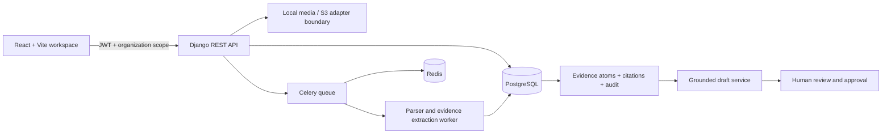

# System architecture

## Tenant isolation

Organizations own documents, evidence, questionnaires, and review tasks. Users join organizations through memberships. API resources resolve the active organization from the `X-Organization-ID` header and reject unknown memberships; list and detail querysets filter through that organization. The frontend selects the first membership by default. New routes must apply the same organization filter before lookup, including nested answers and export resources.

## Document flow

The upload endpoint enforces a 25 MB ceiling and allowlists file MIME types, computes SHA-256, stores a document version, and schedules an idempotent Celery parse. Parser output is saved in sections and evidence atoms with page, row, sheet, document, and version locators. Atoms start unverified. PDF extraction uses PyMuPDF, DOCX uses python-docx, XLSX uses openpyxl in read-only mode, and delimited/text formats are read line by line after bounded file upload.

## AI and review flow

The default deterministic provider is development-only. An OpenAI Responses adapter is available when an operator explicitly configures its API key, model, and base URL. On PostgreSQL, a Celery job stores 1,536-dimensional evidence vectors and HNSW indexes them for cosine search; a second provider adapter uses the OpenAI embeddings endpoint when configured. PostgreSQL retrieval combines cosine similarity with keyword overlap over verified evidence inside the questionnaire tenant and supplies up to eight bounded excerpts. SQLite uses keyword overlap only. The configured model must return structured JSON with source IDs; the server rejects IDs outside the retrieved set, attaches source locators, records token/latency metadata without raw prompt or answer text, and keeps every answer in review. This validates citation identity, not semantic entailment, so reviewers still need to inspect the source. Commitment screening is a conservative phrase rule and blocks matches pending review. Do not expose hidden reasoning in the UI.

## Storage and deployment

The configured Django FileField is the local development storage provider. It is a narrow seam for a production S3-compatible storage backend, which is not yet implemented. Docker Compose defines PostgreSQL/pgvector, Redis, API, worker, and Vite web services. Production deployments must use separate managed PostgreSQL/Redis, private object storage, TLS, secret management, backup/restore, and non-debug settings.

## Data flow diagram notes

Questionnaire upload parsing uses text/row heuristics and does not preserve the buyer's layout. XLSX export writes normalized questions, answers, statuses, and source locators. Semantic embeddings/search, conflict detection, DOCX export, email notifications, Anthropic support, and billing are not implemented yet. These boundaries are also listed in `docs/development-status.md`.
