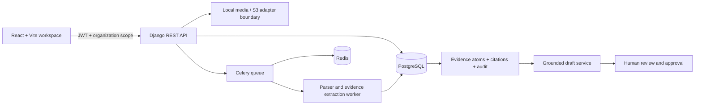

# System architecture

## Tenant isolation

Organizations own documents, evidence, questionnaires, and review tasks. Users join organizations through memberships. API resources resolve the active organization from the `X-Organization-ID` header and reject unknown memberships; list and detail querysets filter through that organization. The frontend selects the first membership by default. New routes must apply the same organization filter before lookup, including nested answers and export resources.

## Document flow

The upload endpoint enforces a 25 MB ceiling and allowlists file MIME types, computes SHA-256, stores a document version, and schedules an idempotent Celery parse. Parser output is saved in sections and evidence atoms with page, row, sheet, document, and version locators. Atoms start unverified. PDF extraction uses PyMuPDF, DOCX uses python-docx, XLSX uses openpyxl in read-only mode, and delimited/text formats are read line by line after bounded file upload.

## AI and review flow

The current deterministic provider searches only verified evidence within the questionnaire tenant. It cites a matched atom and queues review, or blocks the answer with an explicit abstention. Approval requires citations and records an immutable approval event and audit entry. No model-backed provider is enabled by the current answer service; configure a provider adapter before enabling production generation. Do not expose hidden reasoning in the UI.

## Storage and deployment

The configured Django FileField is the local development storage provider. It is a narrow seam for a production S3-compatible storage backend, which is not yet implemented. Docker Compose defines PostgreSQL/pgvector, Redis, API, worker, and Vite web services. Production deployments must use separate managed PostgreSQL/Redis, private object storage, TLS, secret management, backup/restore, and non-debug settings.

## Data flow diagram notes

Questionnaire upload parsing, semantic embeddings/search, conflict detection, XLSX/DOCX export, email notifications, and billing are not implemented yet. Existing questionnaire records can be listed and answers can be drafted against already-recorded questions. These boundaries are also listed in `docs/development-status.md`.
